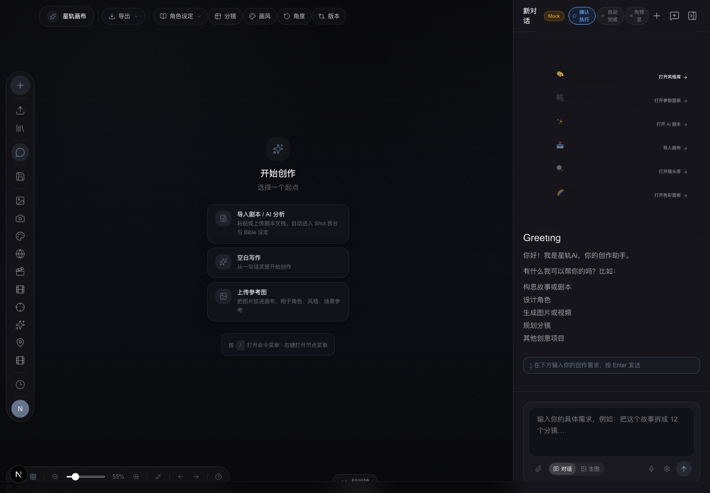
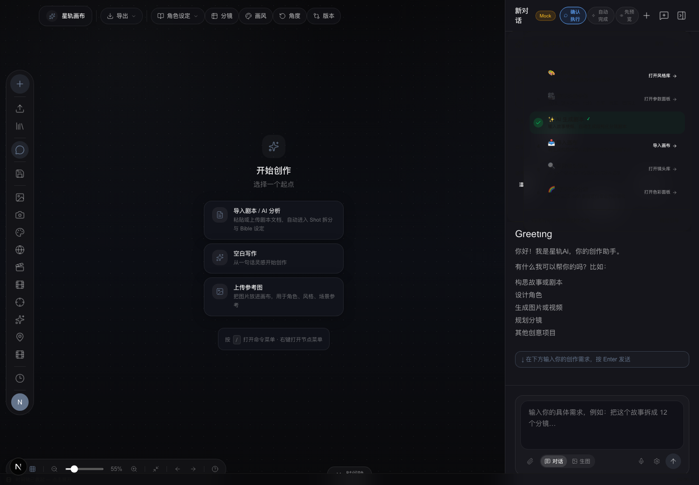
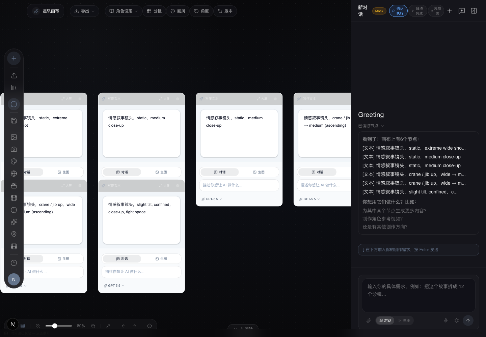
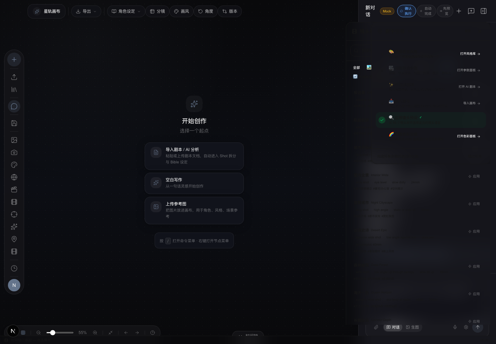
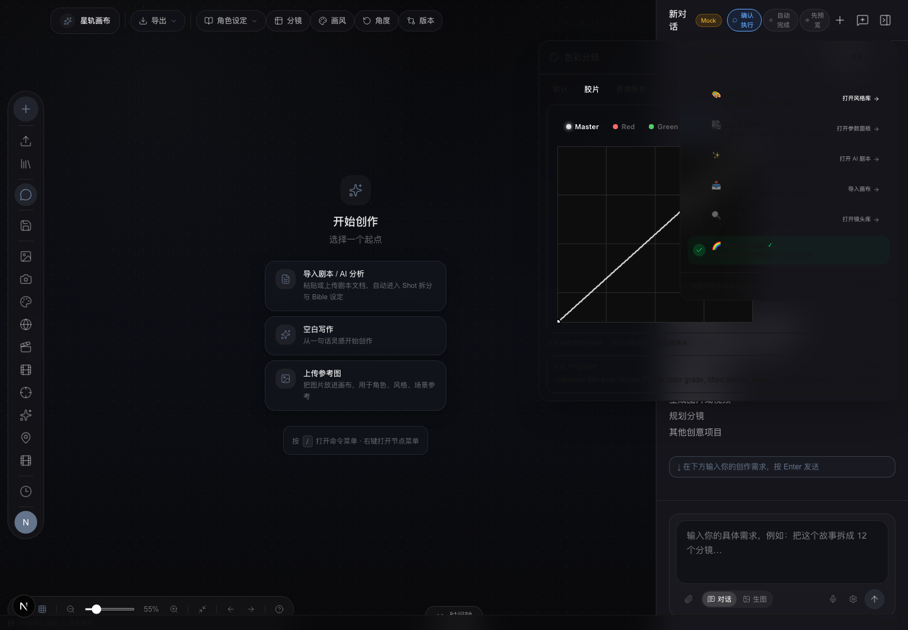
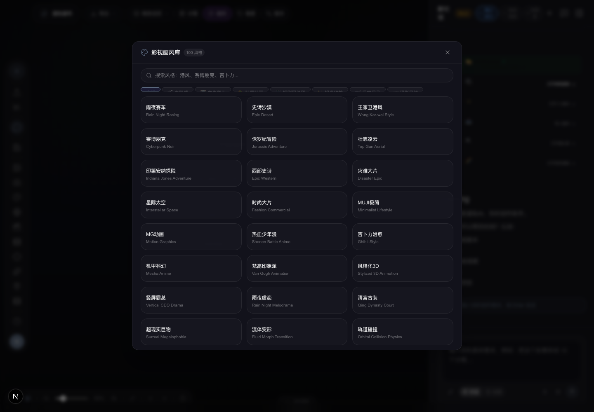
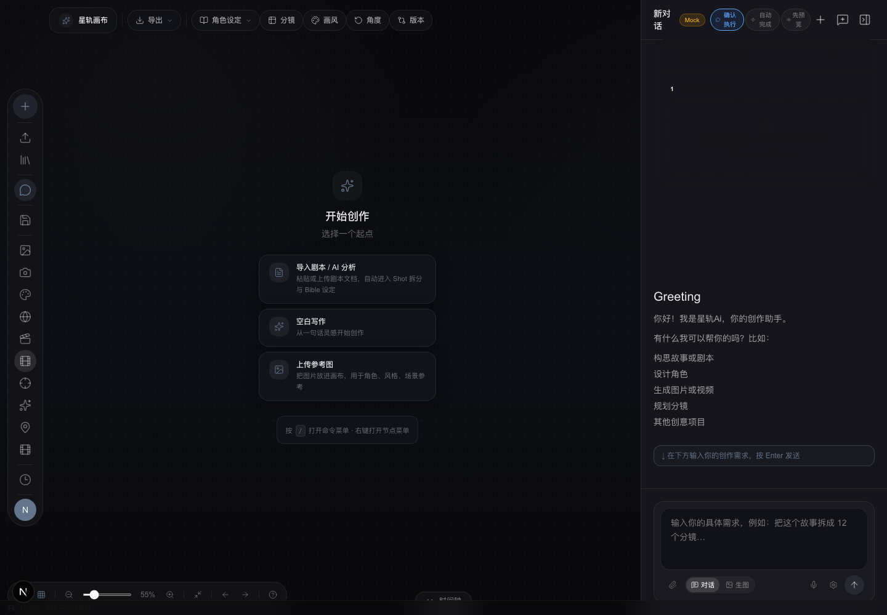

# StarCanvas（星轨画布）

> AI-native infinite canvas for film & TV pre-production.
> 从剧本到成片的 AI 影视前期创作工作台。

<p align="center">
  
  
  
  
  
</p>

<p align="center">
  
  
  
</p>

---

## 这是什么

StarCanvas 是一个**节点式 AI 影视创作无限画布**。创作人员可以在画布上搭建从剧本→分镜→生图→配音→视频→导出的完整管线，每一步都可以单独运行、重试、修改。

对标方向：AI 创作能力（TapNow） + 制片管理能力（小云雀短剧 Agent 2.0）。

## 核心能力

### 创作层 — AI 辅助内容生成

| 能力 | 说明 |
|------|------|
| **AI 剧本生成** | 输入故事梗概，自动生成结构化分镜剧本，每个镜头绑定镜头预设 |
| **参考视频逆向分镜** | 上传参考视频 → 抽取关键帧 → 生成分镜草稿 → 导入画布 |
| **镜头库** | 55 个影视级镜头预设（6 分类），一键应用到分镜节点 |
| **影视级画风库** | 109 种风格 / 7 分类，基于 awesome-seedance (CC BY 4.0) |
| **AI 对话画布** | 流式 SSE 对话，支持 tool calling + canvas actions |
| **角色三视图** | 正/侧/背三视图 AI 生成 + 角色参照锁定 |
| **参数化控制面板** | 景别/镜头运动/光线/色调/景深/画幅比 6 维参数控制 |
| **交互式色彩分级** | 基于 rgb-curve (MIT) 的 RGB 曲线编辑器，实时 LUT 分析 |
| **720° 全景场景图** | 基于 react-pannellum 的全景场景预览 |
| **新手引导** | 6 步 checklist 引导：风格→参数→剧本→画布→镜头→色彩 |
| **紫微斗数角色设计** | 出生信息 → 命盘 → 性格自动映射（144 命盘版） |

### 制片层 — 生产管理与协作

| 能力 | 说明 |
|------|------|
| **分镜表格视图** | 表格/网格双视图切换，批量管理分镜 |
| **时间线多轨编辑器** | 基于 @xzdarcy/react-timeline-editor 的多轨编辑 |
| **生产运行队列** | 批量生图进度追踪，状态机驱动 |
| **ContinuityGuard** | 六维连续性检查（时间/空间/角色/道具/情绪/逻辑） |
| **角色 Bible** | 六层身份锚点（骨相/五官/辨识标记/色值/皮肤纹理/发型） |

### 管理层 — 资产与导出

| 能力 | 说明 |
|------|------|
| **@ 资产调用系统** | 对话中 @mention 调用画布资产 + 悬浮预览 |
| **通用素材库** | 角色/场景/道具集中管理 |
| **剪映草稿导出** | 一键生成 draft_content.json + 素材包 |
| **项目包导出** | 完整项目 manifest + 素材打包 |
| **ffmpeg.wasm 合成** | 浏览器端视频拼接 + 音频叠加 + 字幕 |

### AI 后端

| 能力 | 说明 |
|------|------|
| **22 个 API 端点** | 文生图、图生视频、TTS、角色一致性、Bible 导演等 |
| **7 角色 Film Crew Agent** | Director / DP / Art Director / Costume / Editor / Sound / VFX |
| **多 Provider 支持** | OpenAI 兼容协议，支持任何中转站 |

## 技术栈

| 技术 | 用途 | 版本 |
|------|------|------|
| Next.js App Router | 前端框架 | 16 |
| React | UI 框架 | 19 |
| @xyflow/react | 节点画布引擎 | v12 |
| Zustand | 状态管理 | v5 |
| Tailwind CSS | 样式 | v4 |
| TypeScript | 类型系统 | strict |
| Playwright | E2E 测试 | 1.58 |
| pnpm + Turborepo | Monorepo 构建 | 10.x |

## 快速开始

```bash
# 1. Clone
git clone https://github.com/732642856/starcanvas.git
cd starcanvas

# 2. 安装依赖（需要 Node.js >= 22）
pnpm install

# 3. 配置 AI Provider
cp apps/web/.env.example apps/web/.env.local
# 编辑 apps/web/.env.local：
#   AI_BASE_URL=https://your-proxy.example.com/v1
#   AI_API_KEY=sk-your-key
#   AI_DEFAULT_MODEL=gpt-4o-mini
#   AI_DEFAULT_IMAGE_MODEL=gpt-image-2

# 4. 启动
pnpm dev
# 浏览器打开 http://localhost:3000
```

> 支持任何 OpenAI 兼容协议的中转站（copse.top、API2D、OpenCat 等）。

## 项目结构

```
starcanvas/
├── apps/web/                    # 主应用（Next.js 16）
│   └── src/
│       ├── app/
│       │   ├── canvas/          # 画布核心
│       │   │   ├── StarCanvas.tsx         # 主画布组件
│       │   │   ├── components/
│       │   │   │   ├── nodes/             # 节点组件（17+ 种类型）
│       │   │   │   ├── panels/            # 控制面板
│       │   │   │   ├── canvas/            # 画布组件
│       │   │   │   ├── chat/              # AI 对话
│       │   │   │   └── toolbar/           # 工具栏
│       │   │   ├── hooks/                 # React Hooks
│       │   │   ├── stores/                # Zustand Stores
│       │   │   └── utils/                 # 工具函数
│       │   ├── features/          # 独立功能模块
│       │   │   ├── ai-script/            # AI 剧本生成 (P1-1)
│       │   │   ├── reverse-storyboard/   # 参考视频逆向分镜 (P0-1)
│       │   │   ├── shot-library/         # 镜头库 55 预设 (P1-4)
│       │   │   ├── storyboard/           # 分镜导入适配器
│       │   │   └── onboarding/           # 新手引导
│       │   └── api/ai/                    # AI API 路由（22 端点）
│       └── lib/                           # 共享库
│           ├── ai/                        # AI 服务（prompt 增强、服务器 fetch）
│           ├── agents/                    # Film Crew Agent 定义
│           ├── styles/                    # 风格库（109 种）
│           ├── storyboard/                # 分镜引擎
│           ├── workflow/                  # 工作流执行器
│           └── export/                    # 导出（剪映草稿等）
├── apps/api/                    # NestJS 后端（实验性）
├── packages/                    # 共享包（实验性）
├── docs/                        # 文档（e2e-stability 等）
└── scripts/                     # 工具脚本
```

## 开发

```bash
# 单元测试（633 个）
pnpm --filter web test

# 类型检查
pnpm --filter web exec tsc --noEmit

# E2E 测试
cd apps/web && npx playwright test --project=chromium

# 运行单个测试
pnpm -C apps/web exec node --test --experimental-strip-types src/path/to/file.test.ts
```

### 可选：真实 Vidu production smoke

该检查会真实调用 Vidu，可能产生费用。默认不会发起网络请求。

```bash
STARCANVAS_RUN_REAL_VIDU_SMOKE=1 \
DASHSCOPE_API_KEY=你的 DashScope Key \
STARCANVAS_SMOKE_PROJECT_ID=已有项目 ID \
STARCANVAS_SMOKE_SOURCE_ASSET_ID=已上传图片 Asset ID \
pnpm --filter api test:vidu:smoke
```

输出只包含 run/status/asset ID，不打印密钥或签名 URL。

## Demo 流程

首次打开应用时会自动弹出新手引导，6 步完成一个完整的创作流程：

```
1. 🎨 选择视觉风格   → 从 109 种风格中选择
2. 🎥 调整影调参数   → 6 维 cinematic 参数控制
3. ✨ AI 生成剧本     → 输入故事梗概，自动生成结构化分镜
4. 📥 导入画布        → 剧本转画布节点，每个镜头可单独编辑
5. 🔍 应用镜头预设   → 从 55 种镜头语言中选择并应用到分镜
6. 🌈 调整色彩分级   → 使用交互式 RGB 曲线进行专业调色
```

也可以在左侧工具栏打开 **参考视频逆向分镜**（上传参考视频 → 提取关键帧 → 生成分镜 → 导入画布）。

## 截图预览

<details open>
<summary><b>rc.3 功能截图（点击展开/折叠）</b></summary>

| 功能 | 截图 |
|------|------|
| **新手引导** — 6 步 checklist 引导完整创作流程 |  |
| **AI 剧本生成** — 输入故事梗概，结构化分镜输出 |  |
| **分镜画布** — AI 剧本一键导入画布，可视化编辑 |  |
| **镜头库** — 55 个影视级镜头预设，一键应用 |  |
| **色彩分级** — 交互式 RGB 曲线编辑器 |  |
| **影视风格库** — 109 种风格 / 7 分类 |  |
| **参考视频逆向分镜** — 上传视频 → 抽取关键帧 → 生成分镜 |  |

</details>

## 路线图

当前处于 **v0.1.0-rc.3** 阶段，创建层核心能力已完备。

### 已完成（v0.1.0 rc.2 → rc.3）

- ✅ 参考视频逆向分镜（P0-1）
- ✅ 55 镜头预设库 + 搜索/筛选/应用（P1-4）
- ✅ AI 自动剧本生成 + ShotPreset 绑定（P1-1）
- ✅ 交互式 RGB 曲线色彩分级（P1-6）
- ✅ 影视级画风库 30→109 项（P0-4）
- ✅ 统一 draft-to-canvas 导入链路
- ✅ e2e 稳定性基建 + 项目隔离保护
- ✅ 新手引导 6 步 checklist
- ✅ **截图素材**：7 张功能截图

### 下一步

- [ ] **制片层 UI**：productionRunQueue 可视化管理面板
- [ ] **角色资产库增强**：角色一致性跨镜头传递
- [ ] **多语言支持**：国际化框架

### 长期方向

- 制片管理层对标：MAM（媒体资产管理）开源方案调研
- 社区生态：插件系统 / 自定义节点模板
- 协作：多用户实时协作画布

## 开源协议

MIT License — 详见 [LICENSE](./LICENSE)。

## 参与贡献

欢迎任何形式的贡献！详见 [CONTRIBUTING.md](./CONTRIBUTING.md)。

- [Issue 模板](.github/ISSUE_TEMPLATE/)：Bug 反馈 / 功能建议
- [PR 模板](.github/PULL_REQUEST_TEMPLATE.md)
- 提交规范：`type(scope): description`
- 测试要求：新功能需要包含单元测试

## 致谢

本项目受以下开源项目启发：

| 项目 | 方向 |
|------|------|
| ComfyUI Frontend | 节点 UI、队列/进度设计 |
| ArcReel | 多智能体编排、角色 DNA |
| Moyin Creator | 运镜控制、身份锚点 |
| Remotion (MIT) | React 视频渲染 |
| Linly-Dubbing (MIT) | TTS + 唇形同步 |
